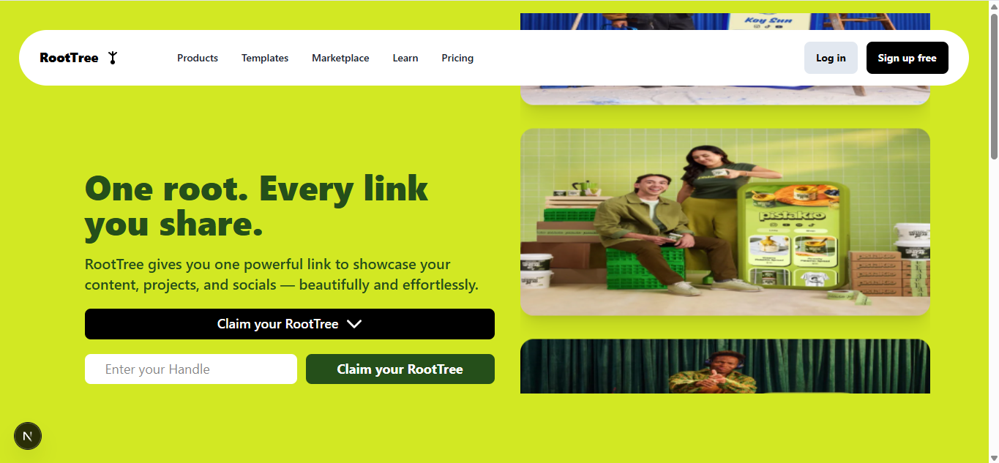
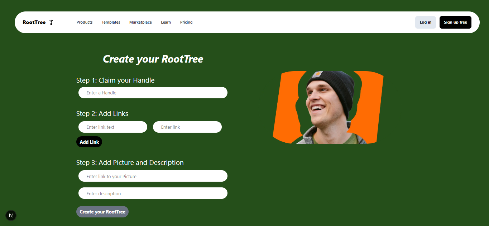

# 🌳 RootTree — Your Personal Link Hub

RootTree is a modern **Linktree alternative** built with **Next.js**, **Tailwind CSS**, and **MongoDB**.  
It allows users to create a single sharable page that hosts all their important links — beautifully and efficiently.

---

## ✨ Features

- 🔗 Create a public profile with multiple links  
- 🎨 Clean, modern & responsive UI  
- ⚡ Fast performance with Next.js App Router  
- 🔐 Authentication using Clerk  
- 🧠 Dynamic user pages (`/username`)  
- 📱 Mobile-first design  
- 🌙 Dark-friendly UI  
- 🚀 Optimized for SEO and performance  

---

## 🛠 Tech Stack

- **Frontend:** Next.js 14 (App Router), Tailwind CSS
- **Backend:** Next.js API Routes
- **Database:** MongoDB + Mongoose
- **Authentication:** Clerk
- **Deployment:** Vercel (recommended)

---

## 📸 Screenshots

> 
> 
